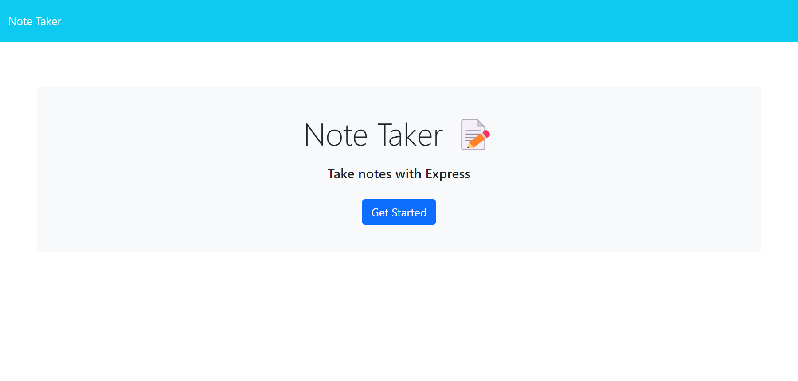
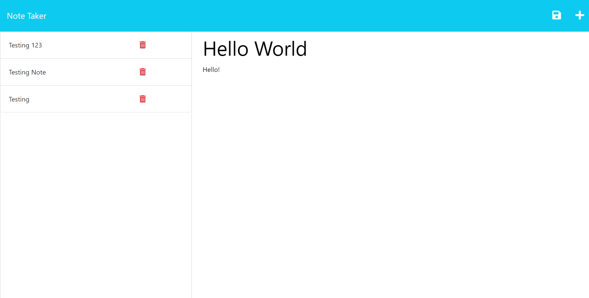
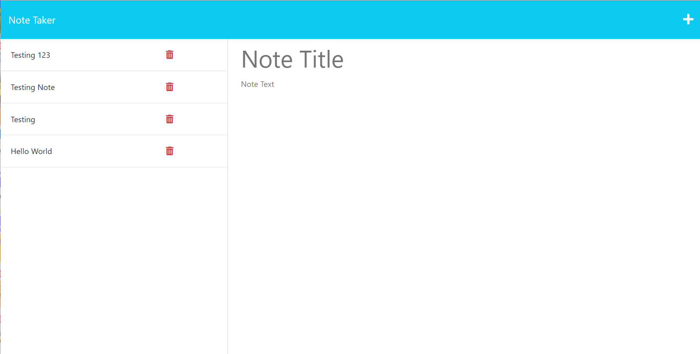

# Note Taker

## Description
This is project using Express js and the "GET" and "POST" method to generate page where users can write text and store it for future reference. This is a full stack page that contains front end as well as back end development. 

## Installation
The page can be accessed from Heroku or from the local host.

## Usage
Once the page is opened, the user can navigate to the Get Started button which will direct them to the note taking page. Once the user fills in the Title and Text components of the note taking page, they will be able to see the save icon appears on the top-right of the page. 

When they click that button, they will be able to see that they have saved their note. 

If they click the saved note located to their right, they will be able to see its contents. 

In the future, I will like to implement the DELETE request so that users can delete their notes without worrying about running out of space. That way, they can navigate to the red garbage bin icon next to their stored notes, and discard the notes they no longer need.

## Credits
n/a

## Licence
n/a